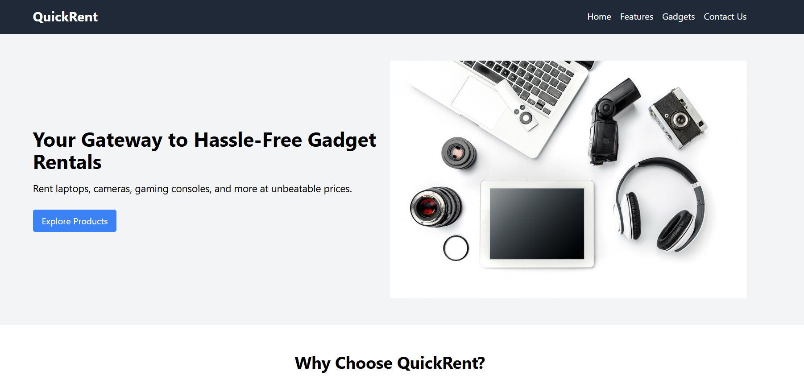
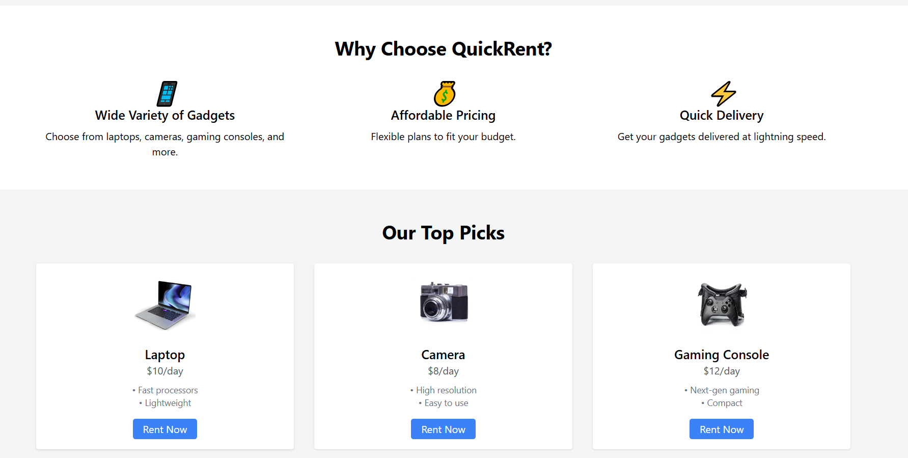
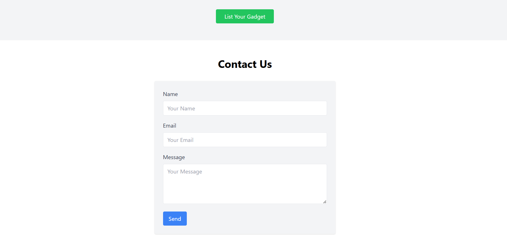

# QuickRent - Gadget Rental Landing Page

---

# Deployed Link

## You can view the deployed project [here](https://quick-rent-nine.vercel.app/).

---

## QuickRent is a responsive and visually appealing landing page for a mock startup that allows users to rent gadgets such as laptops, cameras, and gaming consoles. This project demonstrates design skills, coding proficiency, and the implementation of responsive web design using React and Tailwind CSS.

---

# Features

- ## Hero Section: A captivating introduction with a tagline, call-to-action button, and an image relevant to gadget rentals.

- ## Features Section: Highlights the platform's key features with icons for visual appeal.

- ## Gadgets Section: Displays top gadget picks with pricing, features, and an option to list gadgets for rent. 

- ## Contact Us Section: A simple form to connect with the team, including fields for name, email, and message.

---

# Screenshots 

